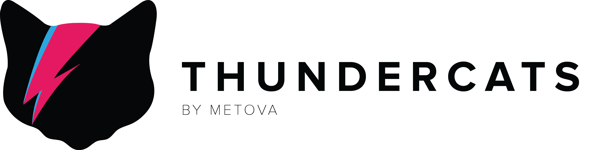

[](https://cocoapods.org/pods/ThunderCats)

[](https://travis-ci.org/metova/ThunderCats)
[](https://cocoapods.org/pods/ThunderCats)
[](http://cocoadocs.org/docsets/ThunderCats/)
[](https://coveralls.io/github/metova/ThunderCats?branch=master)
[](http://cocoadocs.org/docsets/ThunderCats)
[](http://twitter.com/metova)

ThunderCats is a lightweight collection of utility extensions added to existing Foundation & UIKit classes.

-----

## Requirements

- iOS 8.0 or newer

-----

## Installation

ThunderCats is available through [CocoaPods](http://cocoapods.org). To install it simply add the following line to your Podfile:

```ruby
pod 'ThunderCats'
```

If you would like to test a beta version of ThunderCats, you can install the latest from develop:

```ruby
pod 'ThunderCats', :git => 'https://github.com/metova/ThunderCats.git', :branch => 'develop'
```

-----

## Credits

ThunderCats is owned and maintained by [Metova Inc.](https://metova.com)

[Contributors](https://github.com/Metova/ThunderCats/graphs/contributors)

If you would like to contribute to ThunderCats, see our [CONTRIBUTING](CONTRIBUTING.md) guidelines.

ThunderCats banner image and other assets provided by Christi Johnson.

-----

## License

ThunderCats is available under the MIT license. See the [LICENSE](LICENSE) file for more info.
